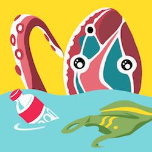
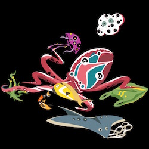
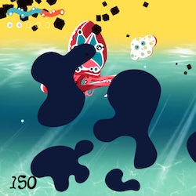
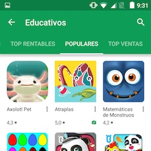
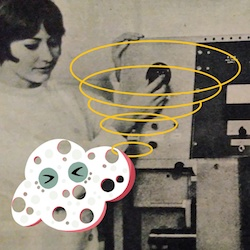
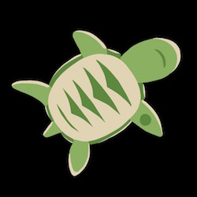

# Atraplas

Atraplás es un pulpo que cuida del planeta.

Ayúdalo a recoger toda la basura que encuentra en el agua y únete al desafío de limpiar los océanos. ¿Puedes decir qué objetos no pertenecen al fondo del mar?

Atrapa la basura a la deriva

Baterías, anillos de plástico, bolsas... ¡incluso pañales! En el mar de Atraplás, hay mucha basura que no vemos desde la superficie. Pesca todo lo que puedas con él y aprende cuántos años tardaría en desaparecer si nadie la retira.

Respeta la vida marina

¡Pero ten cuidado! Atraplás no quiere molestar a los animales que viven en el mar. Si accidentalmente atrapa uno, se angustia y libera tinta. La esponja te ayudará a ver el fondo del mar de nuevo, pero debes recompensarla recogiendo las perlas que ves en la corriente.

